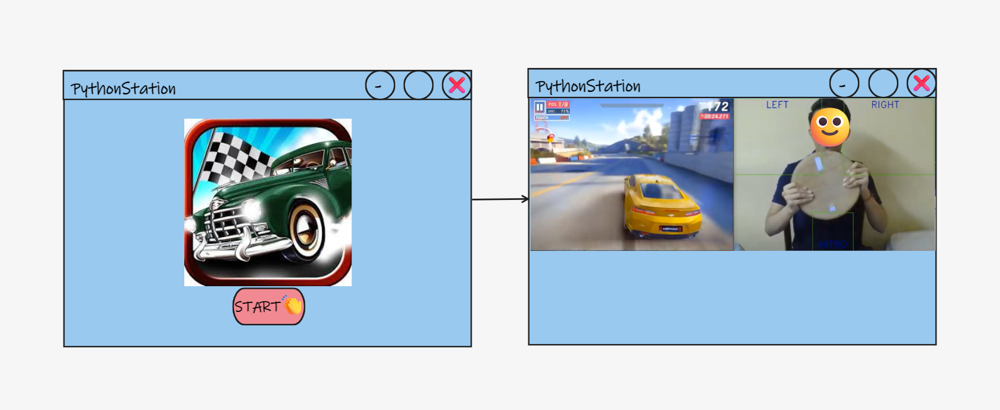

# Project name: PythonStation

## Team members :

    1. Mohammed alsamaki
    2. Ahmad alanaswah
    3. Rihan foudeh
    4. Salsabil mislat
    5. Yousef alramli

## Description for the project :

Creating an application for several Old but Gold games for the joy of the user .  

In the world of adult life we are creating a gate to the old sweet childhood memories , 
And to be known to the new generations to feel the great and golden days of the games of our childhood with all the modern Technology by using motion and voice recognizer 

## Whiteboard
  

## User story :

### Title : Racing Game .

    - As a user i want to play racing game to have some fun  .

###  Feature Tasks: .

    1- user can play racing game by interacting with my hand as a joystice using motion detections .

    2- user can have some controle futers like if i move my right hand to up the care will move right .

    3- user can have some controle futers like if i move my left hand to up the care will move left . 

    4- user can have some controle futers like if i pice my hands together the care will brake .

### Acceptance Tests:
  
    1- Ensure that the user will easy connect his webcam with the game without any issue .
    2- Ensure that the game will detect the user motion without any issue . 
    3- display a grid for the user to put his hand in the right place .
    4- display an error for the user if his/her hand isnt in the right place .

